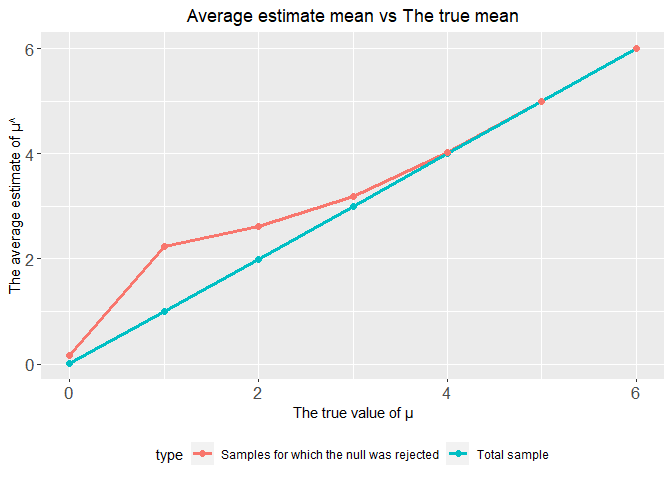
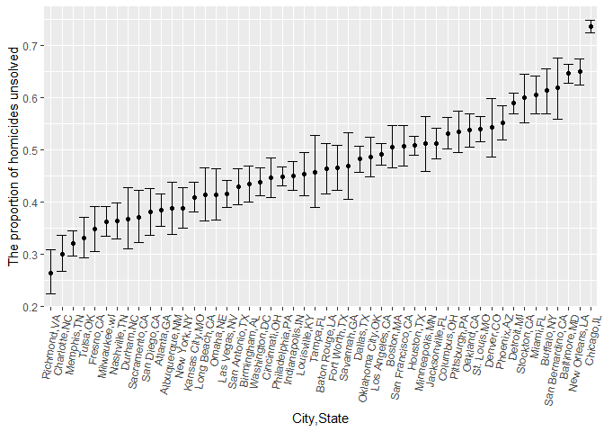
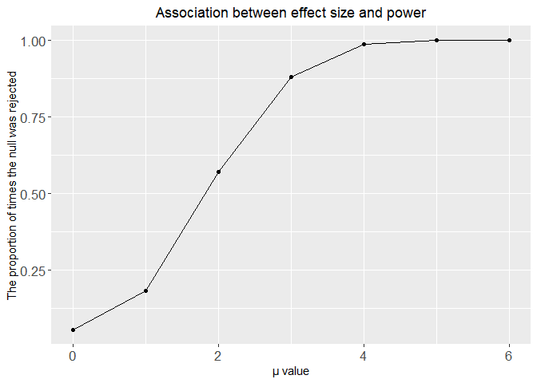
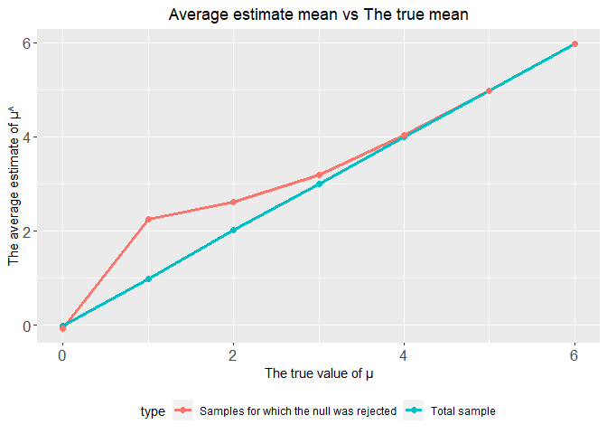

p8105_hw5_hw2861
================
Hongmiao Wang
2022-11-12

## Problem 1

The code chunk below imports the data in individual spreadsheets
contained in `./data/zip_data/`. To do this, I create a dataframe that
includes the list of all files in that directory and the complete path
to each file. As a next step, I `map` over paths and import data using
the `read_csv` function. Finally, I `unnest` the result of `map`.

``` r
full_df = 
  tibble(
    files = list.files("./Data/Q1data/"),
    path = str_c("./Data/Q1data/", files)
  ) %>% 
  mutate(data = map(path, read_csv)) %>% 
  unnest()
```

    ## Rows: 1 Columns: 8
    ## ── Column specification ────────────────────────────────────────────────────────
    ## Delimiter: ","
    ## dbl (8): week_1, week_2, week_3, week_4, week_5, week_6, week_7, week_8
    ## 
    ## ℹ Use `spec()` to retrieve the full column specification for this data.
    ## ℹ Specify the column types or set `show_col_types = FALSE` to quiet this message.
    ## Rows: 1 Columns: 8
    ## ── Column specification ────────────────────────────────────────────────────────
    ## Delimiter: ","
    ## dbl (8): week_1, week_2, week_3, week_4, week_5, week_6, week_7, week_8
    ## 
    ## ℹ Use `spec()` to retrieve the full column specification for this data.
    ## ℹ Specify the column types or set `show_col_types = FALSE` to quiet this message.
    ## Rows: 1 Columns: 8
    ## ── Column specification ────────────────────────────────────────────────────────
    ## Delimiter: ","
    ## dbl (8): week_1, week_2, week_3, week_4, week_5, week_6, week_7, week_8
    ## 
    ## ℹ Use `spec()` to retrieve the full column specification for this data.
    ## ℹ Specify the column types or set `show_col_types = FALSE` to quiet this message.
    ## Rows: 1 Columns: 8
    ## ── Column specification ────────────────────────────────────────────────────────
    ## Delimiter: ","
    ## dbl (8): week_1, week_2, week_3, week_4, week_5, week_6, week_7, week_8
    ## 
    ## ℹ Use `spec()` to retrieve the full column specification for this data.
    ## ℹ Specify the column types or set `show_col_types = FALSE` to quiet this message.
    ## Rows: 1 Columns: 8
    ## ── Column specification ────────────────────────────────────────────────────────
    ## Delimiter: ","
    ## dbl (8): week_1, week_2, week_3, week_4, week_5, week_6, week_7, week_8
    ## 
    ## ℹ Use `spec()` to retrieve the full column specification for this data.
    ## ℹ Specify the column types or set `show_col_types = FALSE` to quiet this message.
    ## Rows: 1 Columns: 8
    ## ── Column specification ────────────────────────────────────────────────────────
    ## Delimiter: ","
    ## dbl (8): week_1, week_2, week_3, week_4, week_5, week_6, week_7, week_8
    ## 
    ## ℹ Use `spec()` to retrieve the full column specification for this data.
    ## ℹ Specify the column types or set `show_col_types = FALSE` to quiet this message.
    ## Rows: 1 Columns: 8
    ## ── Column specification ────────────────────────────────────────────────────────
    ## Delimiter: ","
    ## dbl (8): week_1, week_2, week_3, week_4, week_5, week_6, week_7, week_8
    ## 
    ## ℹ Use `spec()` to retrieve the full column specification for this data.
    ## ℹ Specify the column types or set `show_col_types = FALSE` to quiet this message.
    ## Rows: 1 Columns: 8
    ## ── Column specification ────────────────────────────────────────────────────────
    ## Delimiter: ","
    ## dbl (8): week_1, week_2, week_3, week_4, week_5, week_6, week_7, week_8
    ## 
    ## ℹ Use `spec()` to retrieve the full column specification for this data.
    ## ℹ Specify the column types or set `show_col_types = FALSE` to quiet this message.
    ## Rows: 1 Columns: 8
    ## ── Column specification ────────────────────────────────────────────────────────
    ## Delimiter: ","
    ## dbl (8): week_1, week_2, week_3, week_4, week_5, week_6, week_7, week_8
    ## 
    ## ℹ Use `spec()` to retrieve the full column specification for this data.
    ## ℹ Specify the column types or set `show_col_types = FALSE` to quiet this message.
    ## Rows: 1 Columns: 8
    ## ── Column specification ────────────────────────────────────────────────────────
    ## Delimiter: ","
    ## dbl (8): week_1, week_2, week_3, week_4, week_5, week_6, week_7, week_8
    ## 
    ## ℹ Use `spec()` to retrieve the full column specification for this data.
    ## ℹ Specify the column types or set `show_col_types = FALSE` to quiet this message.
    ## Rows: 1 Columns: 8
    ## ── Column specification ────────────────────────────────────────────────────────
    ## Delimiter: ","
    ## dbl (8): week_1, week_2, week_3, week_4, week_5, week_6, week_7, week_8
    ## 
    ## ℹ Use `spec()` to retrieve the full column specification for this data.
    ## ℹ Specify the column types or set `show_col_types = FALSE` to quiet this message.
    ## Rows: 1 Columns: 8
    ## ── Column specification ────────────────────────────────────────────────────────
    ## Delimiter: ","
    ## dbl (8): week_1, week_2, week_3, week_4, week_5, week_6, week_7, week_8
    ## 
    ## ℹ Use `spec()` to retrieve the full column specification for this data.
    ## ℹ Specify the column types or set `show_col_types = FALSE` to quiet this message.
    ## Rows: 1 Columns: 8
    ## ── Column specification ────────────────────────────────────────────────────────
    ## Delimiter: ","
    ## dbl (8): week_1, week_2, week_3, week_4, week_5, week_6, week_7, week_8
    ## 
    ## ℹ Use `spec()` to retrieve the full column specification for this data.
    ## ℹ Specify the column types or set `show_col_types = FALSE` to quiet this message.
    ## Rows: 1 Columns: 8
    ## ── Column specification ────────────────────────────────────────────────────────
    ## Delimiter: ","
    ## dbl (8): week_1, week_2, week_3, week_4, week_5, week_6, week_7, week_8
    ## 
    ## ℹ Use `spec()` to retrieve the full column specification for this data.
    ## ℹ Specify the column types or set `show_col_types = FALSE` to quiet this message.
    ## Rows: 1 Columns: 8
    ## ── Column specification ────────────────────────────────────────────────────────
    ## Delimiter: ","
    ## dbl (8): week_1, week_2, week_3, week_4, week_5, week_6, week_7, week_8
    ## 
    ## ℹ Use `spec()` to retrieve the full column specification for this data.
    ## ℹ Specify the column types or set `show_col_types = FALSE` to quiet this message.
    ## Rows: 1 Columns: 8
    ## ── Column specification ────────────────────────────────────────────────────────
    ## Delimiter: ","
    ## dbl (8): week_1, week_2, week_3, week_4, week_5, week_6, week_7, week_8
    ## 
    ## ℹ Use `spec()` to retrieve the full column specification for this data.
    ## ℹ Specify the column types or set `show_col_types = FALSE` to quiet this message.
    ## Rows: 1 Columns: 8
    ## ── Column specification ────────────────────────────────────────────────────────
    ## Delimiter: ","
    ## dbl (8): week_1, week_2, week_3, week_4, week_5, week_6, week_7, week_8
    ## 
    ## ℹ Use `spec()` to retrieve the full column specification for this data.
    ## ℹ Specify the column types or set `show_col_types = FALSE` to quiet this message.
    ## Rows: 1 Columns: 8
    ## ── Column specification ────────────────────────────────────────────────────────
    ## Delimiter: ","
    ## dbl (8): week_1, week_2, week_3, week_4, week_5, week_6, week_7, week_8
    ## 
    ## ℹ Use `spec()` to retrieve the full column specification for this data.
    ## ℹ Specify the column types or set `show_col_types = FALSE` to quiet this message.
    ## Rows: 1 Columns: 8
    ## ── Column specification ────────────────────────────────────────────────────────
    ## Delimiter: ","
    ## dbl (8): week_1, week_2, week_3, week_4, week_5, week_6, week_7, week_8
    ## 
    ## ℹ Use `spec()` to retrieve the full column specification for this data.
    ## ℹ Specify the column types or set `show_col_types = FALSE` to quiet this message.
    ## Rows: 1 Columns: 8
    ## ── Column specification ────────────────────────────────────────────────────────
    ## Delimiter: ","
    ## dbl (8): week_1, week_2, week_3, week_4, week_5, week_6, week_7, week_8
    ## 
    ## ℹ Use `spec()` to retrieve the full column specification for this data.
    ## ℹ Specify the column types or set `show_col_types = FALSE` to quiet this message.

    ## Warning: `cols` is now required when using unnest().
    ## Please use `cols = c(data)`

The result of the previous code chunk isn’t tidy – data are wide rather
than long, and some important variables are included as parts of others.
The code chunk below tides the data using string manipulations on the
file, converting from wide to long, and selecting relevant variables.

``` r
tidy_df = 
  full_df %>% 
  mutate(
    files = str_replace(files, ".csv", ""),
    group = str_sub(files, 1, 3)) %>% 
  pivot_longer(
    week_1:week_8,
    names_to = "week",
    values_to = "outcome",
    names_prefix = "week_") %>% 
  mutate(week = as.numeric(week)) %>% 
  select(group, subj = files, week, outcome)
```

Finally, the code chunk below creates a plot showing individual data,
faceted by group.

``` r
tidy_df %>% 
  ggplot(aes(x = week, y = outcome, group = subj, color = group)) + 
  geom_point() + 
  geom_path() + 
  facet_grid(~group)
```

<!-- -->

This plot suggests high within-subject correlation – subjects who start
above average end up above average, and those that start below average
end up below average. Subjects in the control group generally don’t
change over time, but those in the experiment group increase their
outcome in a roughly linear way.

## Problem 2

### Describe the raw data

``` r
homicide_raw_df = 
  read_csv("./Data/homicide-data.csv")
```

    ## Rows: 52179 Columns: 12
    ## ── Column specification ────────────────────────────────────────────────────────
    ## Delimiter: ","
    ## chr (9): uid, victim_last, victim_first, victim_race, victim_age, victim_sex...
    ## dbl (3): reported_date, lat, lon
    ## 
    ## ℹ Use `spec()` to retrieve the full column specification for this data.
    ## ℹ Specify the column types or set `show_col_types = FALSE` to quiet this message.

This raw dataset has 52179 observations and 12 variables. It collected
data on 52179 criminal homicides over the past decade in 50 of the
largest American cities. The data included the location of the killing,
whether an arrest was made and, in most cases, basic demographic
information about each victim.

**create Create a city_state variable**

``` r
homicide_df = 
  read_csv("./Data/homicide-data.csv") %>% 
  mutate(
    city_state = str_c(city, state, sep = ","),
    city_state = recode(city_state,"Tulsa,AL" = "Tulsa,OK"),
    status = case_when(
      disposition == "Closed without arrest" | disposition == "Open/No arrest"   ~ "unsolved",
      TRUE ~ "solved"))
```

    ## Rows: 52179 Columns: 12
    ## ── Column specification ────────────────────────────────────────────────────────
    ## Delimiter: ","
    ## chr (9): uid, victim_last, victim_first, victim_race, victim_age, victim_sex...
    ## dbl (3): reported_date, lat, lon
    ## 
    ## ℹ Use `spec()` to retrieve the full column specification for this data.
    ## ℹ Specify the column types or set `show_col_types = FALSE` to quiet this message.

After cleaning, This dataset now has 52179 observations and 14
variables. I created 2 new variables in this dataset. One is
**“city_state”** and the other is **“status”**. The status is for
marking the status of homicides as solved or unsolved.

### Summarize within cities: to obtain the total number of homicides and the number of unsolved homicides

**The total number of homicides and the number of unsolved homicides in
each cities.**

``` r
homicides_df_number= 
  homicide_df %>%
  select(city_state,status)%>%
  group_by(city_state)%>%
  summarize(
    total_homicides=n(),
    unsolved_homicides=sum(status=="unsolved")) 

    knitr::kable(homicides_df_number)
```

| city_state        | total_homicides | unsolved_homicides |
|:------------------|----------------:|-------------------:|
| Albuquerque,NM    |             378 |                146 |
| Atlanta,GA        |             973 |                373 |
| Baltimore,MD      |            2827 |               1825 |
| Baton Rouge,LA    |             424 |                196 |
| Birmingham,AL     |             800 |                347 |
| Boston,MA         |             614 |                310 |
| Buffalo,NY        |             521 |                319 |
| Charlotte,NC      |             687 |                206 |
| Chicago,IL        |            5535 |               4073 |
| Cincinnati,OH     |             694 |                309 |
| Columbus,OH       |            1084 |                575 |
| Dallas,TX         |            1567 |                754 |
| Denver,CO         |             312 |                169 |
| Detroit,MI        |            2519 |               1482 |
| Durham,NC         |             276 |                101 |
| Fort Worth,TX     |             549 |                255 |
| Fresno,CA         |             487 |                169 |
| Houston,TX        |            2942 |               1493 |
| Indianapolis,IN   |            1322 |                594 |
| Jacksonville,FL   |            1168 |                597 |
| Kansas City,MO    |            1190 |                486 |
| Las Vegas,NV      |            1381 |                572 |
| Long Beach,CA     |             378 |                156 |
| Los Angeles,CA    |            2257 |               1106 |
| Louisville,KY     |             576 |                261 |
| Memphis,TN        |            1514 |                483 |
| Miami,FL          |             744 |                450 |
| Milwaukee,wI      |            1115 |                403 |
| Minneapolis,MN    |             366 |                187 |
| Nashville,TN      |             767 |                278 |
| New Orleans,LA    |            1434 |                930 |
| New York,NY       |             627 |                243 |
| Oakland,CA        |             947 |                508 |
| Oklahoma City,OK  |             672 |                326 |
| Omaha,NE          |             409 |                169 |
| Philadelphia,PA   |            3037 |               1360 |
| Phoenix,AZ        |             914 |                504 |
| Pittsburgh,PA     |             631 |                337 |
| Richmond,VA       |             429 |                113 |
| Sacramento,CA     |             376 |                139 |
| San Antonio,TX    |             833 |                357 |
| San Bernardino,CA |             275 |                170 |
| San Diego,CA      |             461 |                175 |
| San Francisco,CA  |             663 |                336 |
| Savannah,GA       |             246 |                115 |
| St. Louis,MO      |            1677 |                905 |
| Stockton,CA       |             444 |                266 |
| Tampa,FL          |             208 |                 95 |
| Tulsa,OK          |             584 |                193 |
| Washington,DC     |            1345 |                589 |

**The total number of homicides and the number of unsolved homicides in
a specific (e.g. “Baltimore, MD”) cities.**

``` r
homicides_baltimore= 
  homicide_df %>%
  select(city_state,status)%>%
  filter(city_state == "Baltimore,MD") %>%
  group_by(city_state)%>%
  summarize(
    total_homicides=n(),
    unsolved_homicides=sum(status=="unsolved")) 

    knitr::kable(homicides_baltimore)
```

| city_state   | total_homicides | unsolved_homicides |
|:-------------|----------------:|-------------------:|
| Baltimore,MD |            2827 |               1825 |

**The total number of homicides in “Baltimore, MD” is 2827 and the
number of unsolved homicides in “Baltimore, MD” is 1825.**

### For the city of Baltimore, MD, use the prop.test function to estimate the proportion of homicides that are unsolved

``` r
Baltimore_prop=prop.test(
  x= homicides_df_number %>% filter(city_state == "Baltimore,MD")%>% pull(unsolved_homicides), 
  n= homicides_df_number %>% filter(city_state == "Baltimore,MD")%>% pull(total_homicides)
  ) %>% 
  broom::tidy()%>% 
  select(estimate,conf.low,conf.high)

Baltimore_prop
```

    ## # A tibble: 1 × 3
    ##   estimate conf.low conf.high
    ##      <dbl>    <dbl>     <dbl>
    ## 1    0.646    0.628     0.663

``` r
saveRDS(Baltimore_prop, file = "./result/Baltimore_prop.rds")
```

**The proportion of homicides that are unsolved in “Baltimore, MD” is
0.6455607 . The 95CI of the proportion is between 0.6275625 and
0.6631599.** I Saved the output to a RDS file.

### Now run prop.test for each of the cities in my dataset.

**Run the function for each of the cities**

``` r
city_prop_df =
  homicides_df_number %>%
  mutate(
    tests_pre = map2(unsolved_homicides, total_homicides, prop.test),
    test = map(tests_pre, broom::tidy)
  ) %>%
  select(city_state,test)%>%
  unnest(test)%>%
  select(city_state, estimate, conf.low, conf.high)
```

### Create a plot that shows the estimates and 95CIs for each city

``` r
city_prop_df %>% 
  mutate(city_state = fct_reorder(city_state, estimate)) %>% 
  ggplot(aes(x = city_state, y = estimate)) +
  geom_point() + 
  labs(
    x = "City,State",
    y = "The proportion of homicides unsolved")+
  geom_errorbar(aes(ymin = conf.low, ymax = conf.high)) + 
  theme(axis.text.x = element_text(angle = 80, hjust = 1))
```

<!-- -->

## Problem 3

**In this problem, I will conduct a simulation to explore power in a
one-sample t-test.**

### Set the following design elements and generate 5000 datasets from the model given.

**I create a function for the t-test**

``` r
ttest_function = function(n=30, mu, sigma = 5) {
  
  sim_data = tibble(
    x = rnorm(n, mean = mu, sd = sigma)
  )
  
  t_test = sim_data %>% 
    t.test() %>%
    broom::tidy() %>%
    select(estimate, p.value)
  
return(t_test)
}
```

\*\*Generate 5000 datasets from the model for mu=0\*

``` r
sim_0_df = rerun(5000,ttest_function(mu = 0)) %>%
  bind_rows()
```

**Generate 5000 datasets from the model and repeat the above for
different mu（0 to 6)**

``` r
sim_results_df = 
  tibble(mu = c(0,1,2,3,4,5,6)) %>% 
  mutate(
    output_lists = map(.x = mu, ~rerun(5000, ttest_function(mu = .x))),
    estimate_dfs = map(output_lists, bind_rows)) %>% 
  select(-output_lists) %>% 
  unnest(estimate_dfs)
```

### Make a plot showing the proportion of times the null was rejected

``` r
sim_results_df %>%
  group_by(mu)%>%
  summarize(
    total=n(),
    rejected = sum(p.value<0.05),
    prop = rejected/ total) %>% 
  ggplot(aes(x = mu, y = prop)) +
  geom_point() + 
  geom_line() +
  labs(
    x = "μ value",
    y = "The proportion of times the null was rejected",
    title = "Association between effect size and power")+
  theme(plot.title = element_text(hjust = 0.5),axis.text = element_text(size = 13))
```

<!-- -->

**Describe the association between effect size and power**: The effect
size can be calculated by dividing the mean difference by the standard
deviation. And the mean difference is the differences between sample
mean and the theoretical mean. When the True μ value is lower, the power
of the test is also lower.

-   At μ value \< 4, power increases as the effect size increases.

-   At μ value \> 4, the power tends to stabilize at 1.

Besides, If the effect size of the test is large, it is possible to
detect such an effect in smaller sample numbers.

### Make 2 plots about the average estimate of μ^

The first plot: showing the average estimate of μ^ on the y axis and the
true value of μ on the x axis. The second plot: showing the average
estimate of μ^ only in samples for which the null was rejected on the y
axis and the true value of μ on the x axis.

``` r
plot1=
  sim_results_df %>%
  group_by(mu)%>%
   summarize(
    total=n(),
    mu_hat=mean(estimate))%>%
    mutate(type = "Total sample")


plot2= 
  sim_results_df %>%
  filter(p.value<0.05)%>%
  group_by(mu)%>%
   summarize(
    total=n(),
    mu_hat=mean(estimate))%>%
    mutate(type = "Samples for which the null was rejected")
    
    
combine = full_join(plot1, plot2)%>%
   ggplot(aes(y = mu_hat, x = mu,color=type))+
    geom_line(size=1.3) +
    geom_point(size=2)+
    labs(
    x = "The true value of μ",
    y = "The average estimate of μ^",
    title = "Average estimate mean vs The true mean")+
  theme(plot.title = element_text(hjust = 0.5),axis.text = element_text(size = 13),legend.position = "bottom",)
```

    ## Joining, by = c("mu", "total", "mu_hat", "type")

``` r
combine
```

<!-- -->

Power depends on several factors, including: the sample size; the effect
size; and the error variance.

-   For which the null is rejected,

-   When the true μ \>4, the sample average estimate of μ^ is
    approximately equal to the true value.

-   when the true μ value is between 0 and 4(especially if true value =
    1):They have relatively large differences.

When the true μ \>4, the effect size is large enough and the proportion
of times the null was rejected(power) is nearly 1. At this point, the
power is strong and almost all samples are included and consider as
rejected null. The average estimated mean calculated from all 5000
datasets is close to the true mean.

When the true 0 \<μ \<4, the effect size is Not large enough and the
true μ is relatively close to 0. The proportion of times the null was
rejected(power) is low. At this point, many samples were screened out
because they did not reject Null. Only a few number of datasets are
included in our analysis (perhaps even just a few hundred).Then, average
estimated mean is not an good representation of true value.
